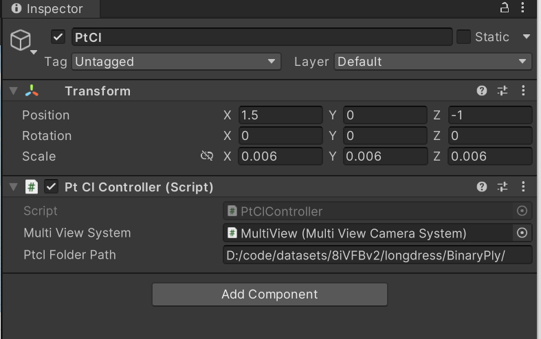
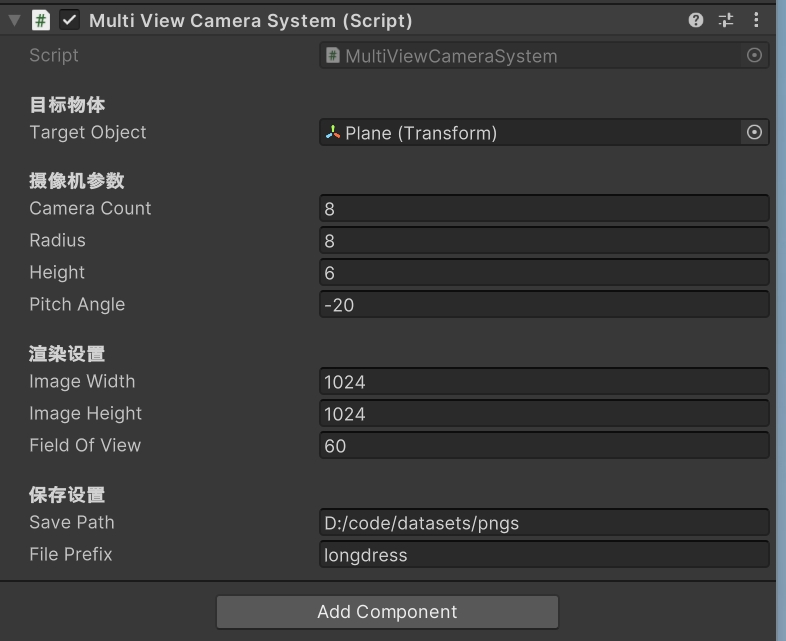

# multiview-capturer - 多视角点云渲染数据集生成工具

## 项目简介

multiview-capturer 是一个基于 Unity 的自动化工具，用于从二进制 PLY 点云文件序列中生成多视角图像数据集。该系统能够：

1. 加载并解析二进制 PLY 点云数据
2. 在 3D 场景中进行渲染
3. 围绕每个点云帧从多个预设相机视角捕获图像
4. 按照配置的命名规则保存图像数据集

## 核心模块说明

### 点云控制模块

点云处理系统是本项目的核心数据处理组件，负责在 Unity 环境中加载、解析和管理来自二进制 PLY 文件的点云数据。主要功能包括：

- 将外部点云数据集转换为 Unity 兼容的网格对象
- 为多视图捕获流程提供可渲染和操作的点云数据

系统由两个主要组件构成：

- `PtCl`：数据容器类
- `PtClController`：Unity MonoBehaviour，负责协调处理工作流程

#### 二进制 PLY 文件处理规范

**头部解析流程**

1. 逐行读取文件，直到找到 `"element vertex"` 声明
2. 从分隔的标记中提取点数信息
3. 继续读取直到遇到 `"end_header"` 或 `"end header"` 标记

**数据格式规范**

| 数据类型 | 字节数 | 存储内容 | 备注  |
| -------- | ------ | -------- | ----- |
| Int16    | 2      | X 坐标   |       |
| Int16    | 2      | Y 坐标   |       |
| Int16    | 2      | Z 坐标   |       |
| Byte     | 1      | 红色分量 | 0-255 |
| Byte     | 1      | 绿色分量 | 0-255 |
| Byte     | 1      | 蓝色分量 | 0-255 |

> 注意：Alpha 通道被固定为 255（完全不透明）

#### 格式转换工具

考虑到大家下载到的点云序列数据集往往是ASCII的文本格式，我们提供了一个 Python 转换脚本，用于将文本格式的点云数据转换为本系统支持的二进制 PLY 格式：

```python
import os
import numpy as np
import open3d as o3d
import struct

def write_binary_ply_with_int16_coords(output_path, points, colors=None):
    """
    将点云数据写入为二进制PLY格式（使用int16存储坐标）
    
    参数:
        output_path: 输出文件路径
        points: (N,3) numpy数组，点坐标
        colors: (N,3) numpy数组，颜色值(0-1范围)，可选
    """
    num_points = points.shape[0]
    has_colors = colors is not None and colors.shape[0] == num_points

    with open(output_path, 'wb') as f:
        # 写入PLY头部信息
        f.write(b'ply\n')
        f.write(b'format binary_little_endian 1.0\n')
        f.write(b'comment Generated by manual PLY writer (int16 coords)\n')
        f.write(b'element vertex %d\n' % num_points)
        f.write(b'property short x\n')  # int16在PLY中对应'short'
        f.write(b'property short y\n')
        f.write(b'property short z\n')
        if has_colors:
            f.write(b'property uchar red\n')
            f.write(b'property uchar green\n')
            f.write(b'property uchar blue\n')
        f.write(b'end_header\n')

        # 写入点数据
        for i in range(num_points):
            # 写入坐标(int16)
            f.write(struct.pack('<hhh',
                               np.int16(points[i, 0]),
                               np.int16(points[i, 1]),
                               np.int16(points[i, 2])))

            # 写入颜色(uchar)
            if has_colors:
                f.write(struct.pack('<BBB',
                                   int(colors[i, 0] * 255),
                                   int(colors[i, 1] * 255),
                                   int(colors[i, 2] * 255)))

def convert_ply_to_binary_int16_manual(input_dir, output_dir):
    # 确保输出目录存在
    if not os.path.exists(output_dir):
        os.makedirs(output_dir)

    # 遍历输入目录中的所有PLY文件
    for filename in os.listdir(input_dir):
        if filename.endswith('.ply'):
            input_path = os.path.join(input_dir, filename)
            output_path = os.path.join(output_dir, filename)

            print(f"Processing: {input_path}")

            try:
                # 读取点云文件
                pcd = o3d.io.read_point_cloud(input_path)

                # 获取点坐标并转换为int16
                points = np.asarray(pcd.points).astype(np.int16)

                # 检查坐标范围是否适合int16
                if np.any(np.abs(points) > 32767):
                    print(f"Warning: Coordinates in {filename} exceed int16 range (-32768 to 32767)")

                # 获取颜色信息(如果有)
                colors = None
                if pcd.has_colors():
                    colors = np.asarray(pcd.colors)

                # 手动写入二进制PLY文件
                write_binary_ply_with_int16_coords(output_path, points, colors)
                print(f"Saved binary PLY (int16 coordinates) to: {output_path}")

            except Exception as e:
                print(f"Error processing {filename}: {str(e)}")

if __name__ == "__main__":
    input_directory = r"D:\code\datasets\8iVFBv2\longdress\Ply"
    output_directory = r"D:\code\datasets\8iVFBv2\longdress\BinaryPly"

    convert_ply_to_binary_int16_manual(input_directory, output_directory)
    print("Conversion completed!")
```

#### 点云序列配置

在 Unity 编辑器中，通过配置 `PtClController` 脚本的参数来指定点云序列：

1. 将 `PtClController` 脚本绑定到游戏对象
2. 在 Inspector 面板中设置点云目录路径
3. 系统会自动按照文件名的自然排序顺序读取 PLY 文件



### 多视点拍摄模块

`MultiViewCameraSystem` 模块负责创建围绕目标物体运行的虚拟相机，从水平圆周上均匀分布的位置拍摄图像。

#### 相机参数配置

| 参数名        | 类型  | 默认值 | 说明                      |
| ------------- | ----- | ------ | ------------------------- |
| `cameraCount` | int   | 8      | 圆周上相机位置的数量      |
| `radius`      | float | 8.0f   | 目标物体到相机位置的距离  |
| `height`      | float | 8.0f   | 目标物体上方的垂直偏移量  |
| `pitchAngle`  | float | 0.0f   | 相机俯仰角度（向下/向上） |
| `fieldOfView` | float | 60.0f  | 相机视场角                |

#### 输出配置

**文件保存参数**

| 参数名       | 类型   | 默认值                    | 说明         |
| ------------ | ------ | ------------------------- | ------------ |
| `savePath`   | string | `"D:/code/datasets/pngs"` | 图像保存目录 |
| `filePrefix` | string | `"longdress"`             | 文件名前缀   |

**文件名格式**

生成的图像文件名遵循以下模式：

```
{filePrefix}_{frameIndex:D4}_{viewIndex:D2}.png
```

- `frameIndex`：当前帧序号（4位数字，前导零填充）
- `viewIndex`：当前视角编号（2位数字，前导零填充）

#### 参数配置方法

在 Unity 编辑器中配置 `MultiViewCameraSystem` 脚本：

1. 将脚本绑定到游戏对象
2. 在 Inspector 面板中设置各项参数
3. 指定目标物体（这里使用静止的平面对象）

> **设计说明**：目标物体选择静止平面而非动态点云的原因：
>
> 1. 点云序列的位置可能动态变化
> 2. 解耦多视点拍摄模块和点云模块
> 3. 简化系统设计，提高稳定性
> 4. 更符合用户直觉和操作习惯

